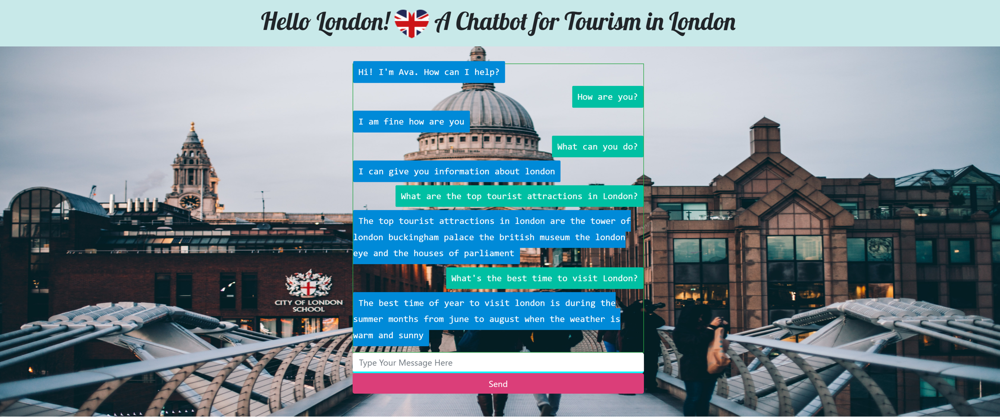

# Python-Chatbot-Project
A Chatbot for London Tourism written in Python with a Flask Interface.  
There are two versions: 
1. A Retrieval Based model using a neural network
2. A Generative version using Seq2Seq LSTM and GRU models with Attention

